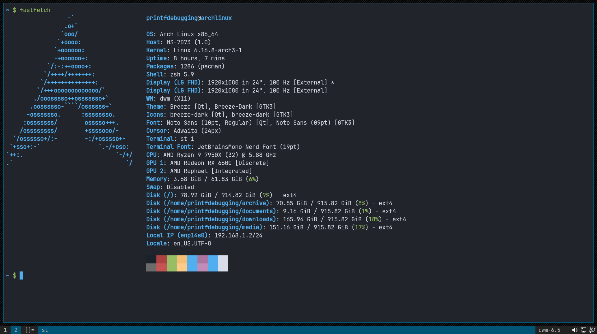

# st

my build of [suckless terminal](https://st.suckless.org/) with quite
a few patches on top. this is the best terminal emulator i have used
till date simply because it's "fast" and "extensible". there are tons
of patches out there to add functionality you need.

